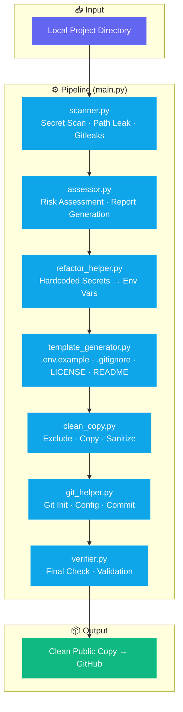

<div align="center">

# 🔧 public-prep

**From "it works on my machine" to "ready to share with the world" — security sanitization, professional packaging, one command.**

[](https://github.com/donglinfei-debug/public-prep/stargazers)
[](https://github.com/donglinfei-debug/public-prep/issues)
[](https://github.com/donglinfei-debug/public-prep/forks)
[](LICENSE)
[](https://www.python.org/)
[]()

🌏 **Language / 语言**：[🇨🇳 中文](README.zh.md) | [🇬🇧 English](README.md)

</div>

---

Your pre-flight checklist before publishing a project to GitHub, **automated**. Scans for secrets, removes local paths, generates `.env.example`/`.gitignore`/`LICENSE`/`README`, and creates a clean copy ready to push.


## 📌 Why This?

You built something cool. It runs on your machine. Now you want to share it on GitHub.

But then doubt creeps in:

> *"Did I leave any API keys in the code?"*
> *"Is my config.py still hardcoding the database password?"*
> *"What if I accidentally commit .env?"*
> *"Will other people even know how to run this?"*
> *"Do I need a LICENSE? A .gitignore? How do I even start?"*

**public-prep** is your automated pre-flight checklist. It scans for secrets, removes local paths, generates the missing files (.env.example, .gitignore, LICENSE, README), and creates a clean copy ready to push — so you can publish with confidence, not doubt.

## 🏗️ Architecture



## ✨ Features

- **🔍 Secret Scanner** — API keys, tokens, passwords, database connection strings
- **📁 Path Leak Detection** — Finds local paths (D:\, C:\Users\) in code
- **🔧 Auto Refactor** — Replaces hardcoded secrets with `os.environ.get()` suggestions
- **📝 Template Generator** — `.env.example`, `.gitignore`, MIT `LICENSE`, `README`
- **🧹 Clean Copy** — Excludes sensitive/temp files, creates a release-ready directory
- **✅ Final Verifier** — Re-scans the clean copy before you publish

## 📦 Requirements

| Requirement | Version |
|:------------|:--------|
| **Python** | 3.8+ |
| **OS** | Windows / macOS / Linux |

## 🚀 Quick Start

```bash
# Scan a project
python main.py --project D:\projects\my-tool

# Full pipeline: scan → refactor → generate → copy → verify
python main.py --project D:\projects\my-tool --output D:\github\my-tool
```

## 📁 Structure

```
public-prep/
├── main.py                    # CLI entry point
├── modules/
│   ├── scanner.py             # Secret & path leak detection
│   ├── assessor.py            # Risk assessment
│   ├── refactor_helper.py     # Hardcoded → env var conversion
│   ├── template_generator.py  # .env / .gitignore / LICENSE / README
│   ├── clean_copy.py          # Filtered project copy
│   ├── git_helper.py          # Git init & commit
│   └── verifier.py            # Final validation
├── rules/
│   ├── scan_rules.py          # Scan pattern definitions
│   └── exclude_patterns.py    # Exclusion rules
├── templates/
│   ├── LICENSE_MIT.txt
│   ├── env_example.txt
│   └── gitignore/ / readme/
├── README.md / README.zh.md
└── REQUIREMENTS_CHECKLIST.md
```


---

## 🔍 Keywords & Search Terms

**IBKR options trading automation**, **Interactive Brokers Python API**, **options trading bot architecture**, **Iron Condor strategy automation**, **SPX options trading**, **IBKR API connection management**, **automated options trading system**, **TWS API Python**, **IB Gateway integration**, **options chain data fetching**, **limit order price adjustment**, **trading risk control debounce**, **Feishu bot notification**, **DingTalk webhook integration**, **Gmail AI summary notification**, **Google Apps Script Gmail monitoring**, **AI subtitle proofreading**, **ASR speech recognition**, **DeepSeek API integration**, **Alibaba Cloud fun-asr**, **subtitle generation automation**, **Claude Code planning skill**, **AI structured planning framework**, **GitHub public-prep security scan**, **open source project sanitization**, **secret detection automation**, **public repository checklist**
## 📄 License

MIT © 2026 Ryan Dong

## 🌟 Star History

[](https://star-history.com/#donglinfei-debug/public-prep&Date)

## 📬 Contact

Ryan Dong — donglinfei@gmail.com
