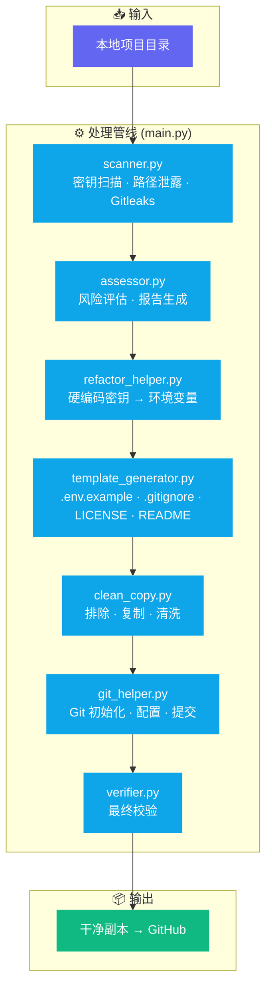

<div align="center">

# 🔧 public-prep

**把"本地能跑"变成"可以安心公开"——安全清洗、专业包装、一键就绪。**

[](https://github.com/donglinfei-debug/public-prep/stargazers)
[](https://github.com/donglinfei-debug/public-prep/issues)
[](https://github.com/donglinfei-debug/public-prep/forks)
[](LICENSE)
[](https://www.python.org/)
[]()

🌏 **语言 / Language**：[🇨🇳 中文](README.zh.md) | [🇬🇧 English](README.md)

</div>

---

项目公开前的一站式预处理工具。自动扫描密钥泄露、清理本地路径、生成 `.env.example` / `.gitignore` / LICENSE / README，创建干净的发布副本。

## 🏗️ 架构示意



## ✨ 功能特性

- **🔍 密钥扫描** — API Key、Token、密码、数据库连接串
- **📁 路径泄露检测** — 发现代码中的本地路径（D:\、C:\Users\）
- **🔧 自动重构** — 硬编码密钥替换为 `os.environ.get()` 建议
- **📝 模板生成** — `.env.example`、`.gitignore`、MIT License、README
- **🧹 干净拷贝** — 排除敏感/临时文件，生成可发布的目录
- **✅ 最终验证** — 重新扫描发布副本，确保安全

## 📦 系统要求

| 要求 | 版本 |
|:-----|:------|
| **Python** | 3.8+ |
| **操作系统** | Windows / macOS / Linux |

## 🚀 快速开始

```bash
# 扫描项目
python main.py --project D:\projects\my-tool

# 全流程：扫描 → 重构 → 生成 → 拷贝 → 验证
python main.py --project D:\projects\my-tool --output D:\github\my-tool
```

## 📁 文件结构

```
public-prep/
├── main.py                    # CLI 入口
├── modules/
│   ├── scanner.py             # 密钥与路径泄露检测
│   ├── assessor.py            # 风险评估
│   ├── refactor_helper.py     # 硬编码 → 环境变量
│   ├── template_generator.py  # 模板生成
│   ├── clean_copy.py          # 过滤拷贝
│   ├── git_helper.py          # Git 初始化和提交
│   └── verifier.py            # 最终验证
├── rules/
├── templates/
├── README.md / README.zh.md
└── REQUIREMENTS_CHECKLIST.md
```

## 📄 许可证

MIT © 2026 Ryan Dong

## 🌟 Star 历史

[](https://star-history.com/#donglinfei-debug/public-prep&Date)

## 📬 联系方式

Ryan Dong — donglinfei@gmail.com
